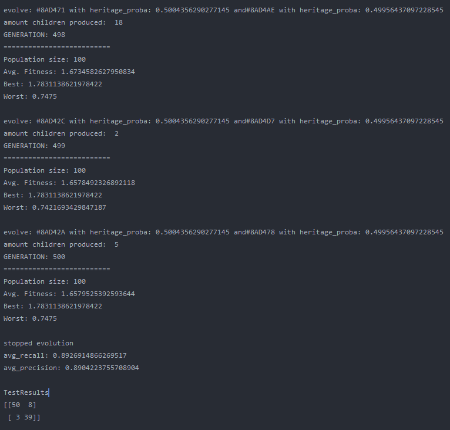

# GeneticNumpyNet

This Repository is an extension to the repository NumpyNet. It takes the approach from creating a neuronal network library in plain python and numpy from scratch a step further and trains a neuronal network, not with the classical gradient descent method, but with a genetic algorithm which is inspired by mother nature itself and tries to mimic the evolution. However, this approach is not new and was very famous before deep learning took over - everything. Instead of one model, 100 models will be created at the same time but only those with the best fitness (performance) will give their genes into the next generation. GAs have a retrospectively comprehensible training process, even if they relay on more randomness. It's beautiful to see how the avg. fitness of the population increases and an equally good neuronal network is able to classify input data at the end.

It's strongly suggested to familiarize your self with the NumpyNet repository first, in order to keep track of how everything is connected and also GeneticNumpyNet uses parts of the NumpyNet files.
All pictures used in this readme file can be found in *_meta*.

### How use GeneticNumpyNet

#### Dependencies
The project includes a Pipefile with all dependencies required as well as a requirements.txt. The project was written in python 3.7 so make sure you use at least 3.7.*. Libraries used for this project:

- numpy

- glob (for visualizations)
- pillow (for visualizations)
- matplotlib (for visualizations)
- sklearn (only used for experiment data generation in *experiment/classification*)

#### Usage
GeneticNumpyNet specific files can be found in *genetic_extension* while a small but useful copy of NumpyNet is rooted in *simple_numpy_net*.
In order to use GeneticNumpyNet one would initialize a model in the following way:
```
# import project related modules
from simple_numpy_net.dense import Dense
from simple_numpy_net.activation import RelU, Sigmoid
from simple_numpy_net.metric import NaiveClassificationMatrix
from genetic_extension.models import GeneticModel

# set up a model - check NumpyNet for more information
# it's basically the same way you would use Sequential like in Keras
model = GeneticModel([
    Dense(4, input_layer=True),
    RelU(),
    Dense(16),
    Sigmoid(),
    Dense(2, activation="softmax")
   ],
    generation_limit=500,  # maximum of generations to run (iterations)
    population_size=100,   # set the size of populations (networks generated)
    fitness_limit=1.9      # set a maximum fitness value (based on fitness function 2 is the absolute max)
)

# train the model on X and y data, and define the max replacement of the generation
# by children of the population in percent (e.g pop size 100 -> 20% => 20 maximum replaced)
model.train(X, y, generation_replacement=0.2)

# test data and get classification matrix
print("\nTestResults")
test_prediction = model.predict(X_test)
matrix = NaiveClassificationMatrix().fit(test_prediction, y_test)
print(matrix)

```

### Validation Test Cases
In order to compare the results to NumpyNet results we take the same data as used in NumpyNet for it's simple classification task.

#### Simple Classification Problem
Files and Code for the test case can be found in *experiment/classification.py*. It is about a generated data set with only two features and two classes to predict. This was the initial test case in order to see whether NumpyNet works.


##### Results
Overall the training went quite well and the output model did a good job on the test data. The population size was set to 100 and the maximum generations was set to 500, with a limit in fitness of 1.9.
The fitness was calculated by avg. precision + avg. recall, which is simple but effective enough for this use case.
On test data the classification matrix looks like this:

|              -      |     predicted 0      |     predicted 1      |  
:--------------------:|:--------------------:|:--------------------:|
|        class 0      |          50          |          8           |  
|        class 1      |           3          |          39          |  

recall: 0.8620
precision: 0.9433



###### Compared to NumpyNet
Overall NumpyNet did better than GeneticNumpyNet. With 98% on precision and recall it was more effective than the Genetic Algorithm. However, one could say that this is depended on the parameter settings. So with more generations
or a larger population size the results might be better. This is true, but another fact is that GeneticNumpyNet is also way slower than the gradient descent method. However, it's more beautiful to see how the Model is trained :D.


### Limitations and Further Improvements
GeneticNumpyNet is very slow. This is partly depended on the nature of the algorithm but also because the code was not designed to be perfectly efficient. It was more a tryout to implement such an algorithm from scratch and without any library beside numpy and plain python. Also no framework beside the theory of the algorithm was used to implement it so it might be, that the implementation is not perfectly accurate according to other software packages. Also the the code is less generic as NumpyNet. An improvement could be the speed of the algorithm as well as a fitness function for a regression problem.